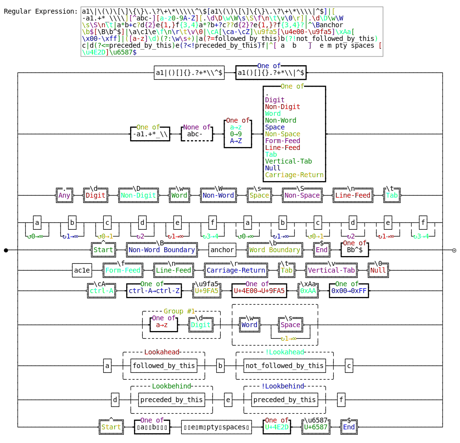

# RegexParser

A terminal tool to parse and visualize regular expression.

Supported Syntax: [Regular Expression Syntax](RegularExpression.md)

## Build and Install

```sh
# build
make

# install
make install
```

## Run unittest

```sh
make test
```


## Basic Usages

```sh
# Parse a specified regular expression
build/regexparser '^\w+([-+.]\w+)*@\w+([-.]\w+)*\.\w+([-.]\w+)*$'

# Read from stdin
echo "a+b*[0-9]+" | build/regexparser

# Print ansi-colored result
build/regexparser -c '[a-zA-Z0-9][-a-zA-Z0-9]{0,62}(\.[a-zA-Z0-9][-a-zA-Z0-9]{0,62})+\.?'

# Generate and parse a random regular expression
build/regexparser -g 20

# Output the syntax tree
build/regexparser -g 20 -f tree

# Show more usage details
build/regexparser -h
```

## An Example of Text Graph Output

```
Regular Expression: ^(\-|\+)?\d+(\.\d+)?$
                                                                            
              ╭Group #1╴╮                                                   
              ╷   ┌─┐   ╷                   ╭╴╴╴╴╴Group #2╴╴╴╴╴╮            
              ╷ ┌─┤-├─┐ ╷                   ╷                  ╷            
   ╔══^══╗    ╷ │ └─┘ │ ╷      ╔═\d══╗      ╷ ┌─┐    ╔═\d══╗   ╷    ╔═$═╗   
●──╣Start╠──┬─┼─┤ ┌─┐ ├─┼─┬──┬─╣Digit╠─┬──┬─┼─┤.├──┬─╣Digit╠─┬─┼─┬──╣End╠──◎
   ╚═════╝  │ ╷ └─┤+├─┘ ╷ │  │ ╚═════╝ │  │ ╷ └─┘  │ ╚═════╝ │ ╷ │  ╚═══╝   
            │ ╷   └─┘   ╷ │  └──↻1→∞───┘  │ ╷      └──↻1→∞───┘ ╷ │          
            │ ╷         ╷ │               │ ╰╴╴╴╴╴╴╴╴╴╴╴╴╴╴╴╴╴╴╯ │          
            │ ╰╴╴╴╴╴╴╴╴╴╯ │               └─────────↺0→1─────────┘          
            └────↺0→1─────┘  
```


## DFA States and Graph

```sh
# DFA states table and graph output
build/regexparser -fd '(a[ab]c|b[bc]c|c[ac]c)'
```

```
Regular Expression: (a[ab]c|b[bc]c|c[ac]c)

========== DFA Start ==========
      Tokens: a b c
    >State 0: 1 2 3
     State 1: 4 4 -
     State 2: - 4 4
     State 3: 4 - 4
     State 4: - - 8
    *State 8: - - -
Accept States: 8
==========  DFA End  ==========
                   a                        
                  ┌>─────┐                  
                  │      ↓                  
  ┏━━━━━┓c   ╭────┴╮c   ╭┴────╮c   ╔═════╗  
 →┃  0  ┃───>│  3  │───>│  4  │───>║  8  ║  
  ┗━━━━┬┛    ╰─────╯    ╰┬────╯    ╚═════╝  
       │                 ↑                  
      b│                 │                  
   ┌──<┤                 │                  
   │   │a                │                  
   │   └>─────┐          │                  
   │          │    b     │                  
   │          │   ┌>─────┤                  
   │          │   │a     │                  
   │          │   ├>─────┤                  
   │    c     │   │      │                  
   │   ┌>─────┼───┼──────┤                  
   │   │b     │   │      │                  
   │   ├>─────┼───┼──────┘                  
   ↓   │      ↓   │                         
  ╭┴───┴╮    ╭┴───┴╮                        
  │  2  │    │  1  │                        
  ╰─────╯    ╰─────╯             
```

## Examples of SVG and HTML Format Output

[svg example](examples/example.svg)



[html example](examples/example.html)

<iframe height="100%" width="100%" src="examples/example.html"></iframe>